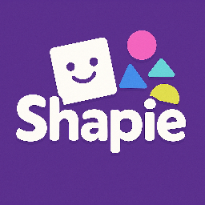
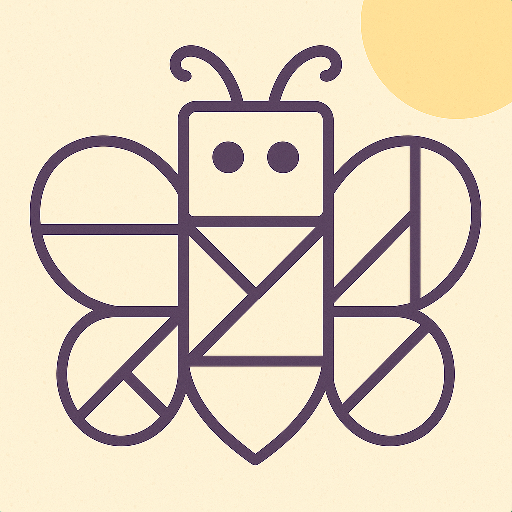
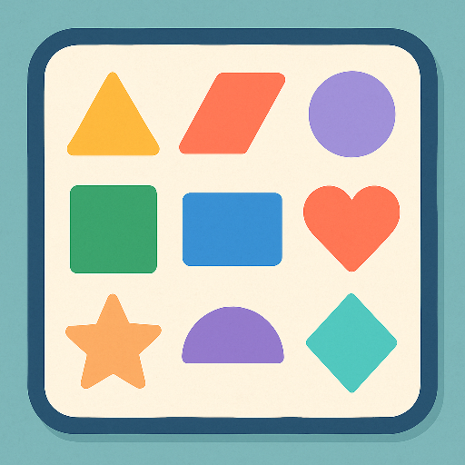
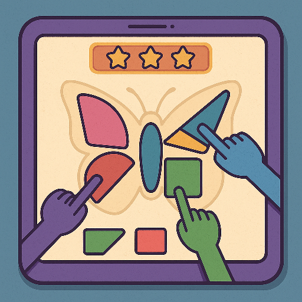

# 🎨 Shapie

**"מצאתי, הרכבתי, ניצחתי!"**

---

## מהות המשחק

*משחק מחשב שיתופי לשניים עד שלושה שחקנים היושבים יחד סביב מסך אחד ולכל אחד מחשב/טאבלט.*
בכל שלב מופיעה דמות, חפץ או עצם מוכר (למשל פרפר, בית, מכונית), ולאחר כמה שניות הוא נעלם — ונשארת רק השבלונה הריקה שלו עם קווי מתאר פנימיים.

השחקנים חייבים **לבחור, לסובב ולמקם יחד את הצורות המתאימות** כך שימלאו את השבלונה במדויק.
לכל שחקן יש גישה לפונקציה אחת בלבד, ולכן רק שיתוף פעולה מאפשר הצלחה.

המשחק נועד לשפר מיומנויות תקשורת, תכנון מרחבי, ויסות, וקבלת החלטות משותפת בקרב בני נוער על הספקטרום האוטיסטי בתפקוד גבוה.

**פלטפורמה:** מסך אחד להצגת הצורה והפתיח, ומחשב/טאבלט לכל אחד על מנת להשתתף במשחק.

---

## רכיבים רשמיים

### 1. שחקנים

* **קהל יעד:** בני נוער על הספקטרום האוטיסטי בתפקוד גבוה, גילאי 10–17.
* **מספר שחקנים:** 2–3 משתתפים סביב מסך מגע אחד.
* **אינטראקציה:** שיתופית בלבד – כל פעולה דורשת שיתוף פעולה.

#### תפקידים:

* 🟣 **מעצב:** בוחר את הצורות הנכונות מהמאגר.

* 🔵 **מסובב:** אחראי לסיבוב החלקים לזווית הנכונה
* 🟢 **ממקם:** גורר את הצורה למקום הנכון בשבלונה.

בכל שלב התפקידים מתחלפים, כך שכל שחקן חווה תפקידים שונים ותרגל תקשורת מגוונת.

---

### 2. יעדים

* להשלים את השבלונה כך שכל הצורות יתאימו באופן מושלם.
* לסיים שלושה שלבים שונים בזמן מוקצב.
* להגיע לרמת דיוק גבוהה (כוכבים, ניקוד קבוצתי).

המשחק מודיע על היעדים באמצעות סימונים חזותיים, קוליים ואנימציה בתחילת כל שלב.

---

### 3. תהליכים

#### תחילת המשחק (30 שניות ראשונות)

* מופיעה אנימציה צבעונית של עצם (למשל צב ים).
* לאחר מכן הוא נעלם ונשארת השבלונה בלבד.
* הצוות רואה מדריך קצר (אינטראקטיבי) שמראה איך לשתף פעולה —
  לדוגמה: "מעצב – בחר צורה!", "מסובב – סובב את הצורה כך שתתאים", "ממקם – גרור את הצורה למקום!"

#### תהליך הליבה

* בכל שלב מופיע עצם חדש ומורכב יותר.
* כל שחקן פועל רק לפי הכלים שלו לפי הסדר (בחירה, סיבוב ואז גרירה למקום).
* המשחק מחייב שיח רציף (“תביא משולש!”, “סובב ימינה!”).
* רק אם כל השחקנים מבצעים את הפעולות בסדר הנכון, הצורה “ננעלת” במקום והשלב מתקדם.

#### תהליך הסיום

* לאחר השלמת שלושה שלבים, מוצגת האנימציה של כל הדמויות שהורכבו —
  כולן “מתעוררות לחיים” ומבצעות ריקוד קצר משותף 🎉
* מתקבל ניקוד קבוצתי ומשוב חיובי קולית (“איזו עבודת צוות נהדרת!”).

#### למידת המשחק

* מתבצעת דרך מדריך אינטראקטיבי ושפה פשוטה (קולית וחזותית).
* בכל פעם ששחקן מתבלבל, המשחק נותן רמז קל (“נסה לסובב עוד קצת ימינה, צורות מיותרות יורדות מהמאגר”).

---

### 4. חוקים

* כל שחקן שולט רק בפונקציה אחת (בחירה / סיבוב / גרירה).
* אין מעבר של חלקים בין שחקנים.
* רק פעולה מתואמת של כל המשתתפים תגרום לשבלונה להתמלא.
* פעולה שגויה גורמת לעיכוב של 3 שניות לפני ניסיון נוסף.
* החוקים מוסברים בצורה חזותית לפני כל שלב, בעזרת אנימציות פשוטות.

---

### 5. משאבים

* **זמן:** השחקנים חייבים להשלים כל שבלונה בזמן מוקצב.
* **רמזים:** שלושה רמזים זמינים בלבד.
* **כוכבים:** מדד ההצלחה הקבוצתי.

המשאבים מוצגים בפס צבעוני בראש המסך עם אייקונים גדולים וברורים.

---

### 6. עימותים

* **נגד המערכת:** מגבלת זמן, חוסר רמזים, שלבים מורכבים יותר.
* **בין שחקנים:** הצורך לתאם בין הפעולות, הקשבה ותכנון רצף. אם אחד פועל מהר מדי, המשחק מציג הודעה “חכה לחבריך!”
* **פנימי:** התמודדות עם תסכול, המתנה לתור, או תחושת חוסר שליטה.

---

### 7. גבולות

* עולם המשחק סגור ומורכב ממסך אחד מרכזי.
* הגבולות מוצגים באופן גרפי (שוליים צבעוניים).
* המשחק שומר על עקרונות עיצוב רגוע – צבעים פסטליים, אנימציות איטיות, ומוזיקה מרגיעה.
* המפה מקיימת עקרונות תכנון של **משמעות, התמצאות ועניין** בכך שכל שלב חושף עצם חדש ומוכר.

---

### 8. תוצאות

* **ניצחון:** כל הצורות הונחו במדויק, הדמות נבנית במלואה, והאנימציה מופעלת.
* **כישלון:** נגמר הזמן או הונחו חלקים שגויים.
* התוצאה מבוססת על תיאום ותקשורת, לא על מזל.
* המשחק שיתופי בלבד – אין ניקוד אישי.

---

## סקירת משחקים קיימים

**ביטויי חיפוש:**
“cooperative puzzle shapes game offline”, “team building visual coordination game”, “shape matching kids therapy game”.

**1. Snipperclips**
[קישור](https://store.steampowered.com/app/563560/Snipperclips/)
משחק לשניים שדורש התאמה של צורות על מסך אחד.
➡️ אצלנו יש עד שלושה משתתפים ותפקידים מוגדרים, לא רק שליטה בשתי דמויות.

**2. Tangram Master**
[קישור](https://play.google.com/store/apps/details?id=com.tangram.master)
משחק יחיד להרכבת צורות ממקטעים.
➡️ אצלנו ההרכבה קולקטיבית – אף אחד לא יכול לבצע לבד.

**3. Human Fall Flat**
[קישור](https://store.steampowered.com/app/477160/Human_Fall_Flat/)
משחק שיתופי עם שליטה משותפת על פתרון פיזי.
➡️ אצלנו הפעולות עצמן מבוזרות בין המשתתפים – מודל שיתופי מובהק.

**ייחודיות המשחק:**
השילוב בין **שליטה מבוזרת**, **תפקידים מתחלפים**, ו**מטרה משותפת חזותית** יוצר חוויה שיתופית מושלמת לפיתוח תקשורת, תכנון ותיאום.
הרכיב שמדגיש את הייחודיות הוא **שיתוף הפעולה הפיזי־חזותי בזמן אמת** בין משתתפים סביב מסך אחד.

